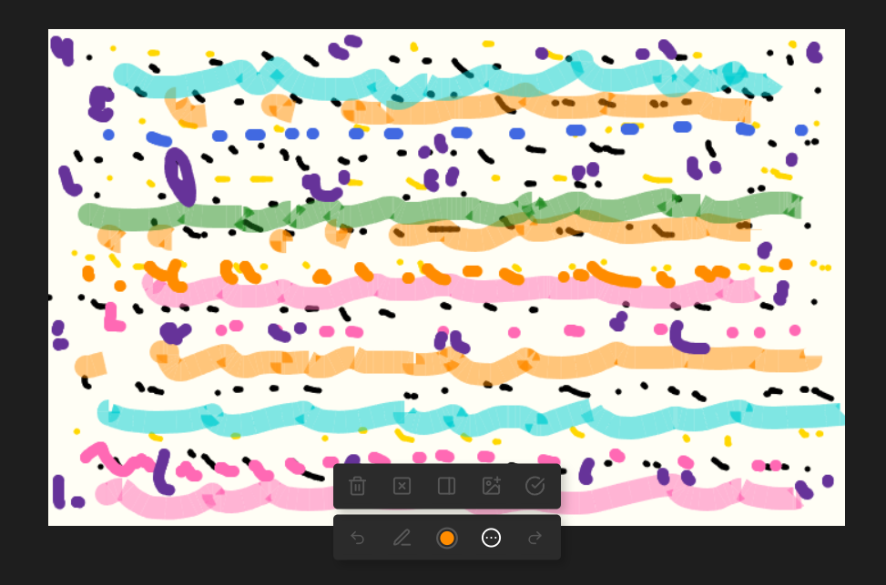
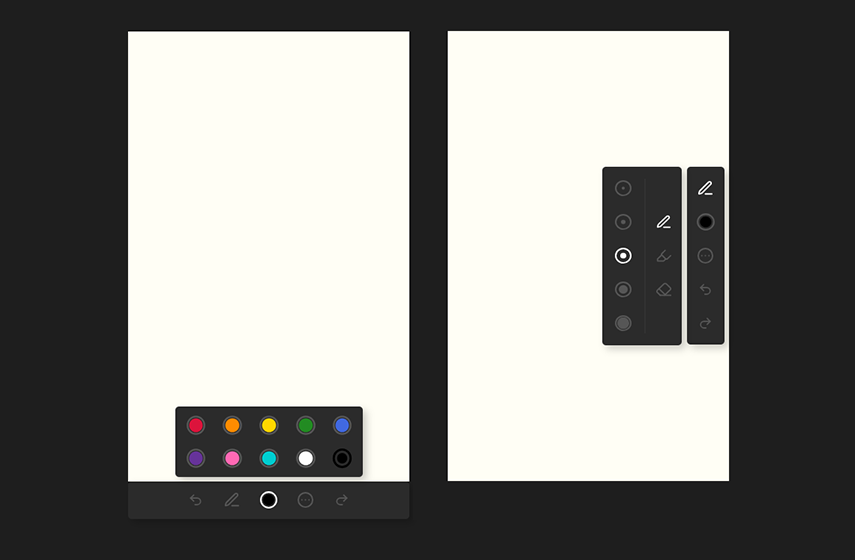
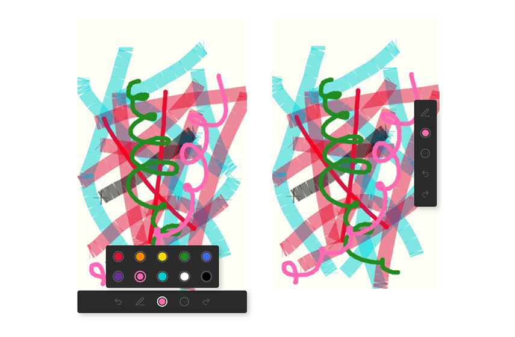
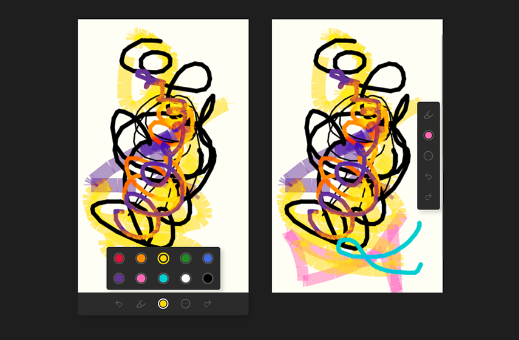
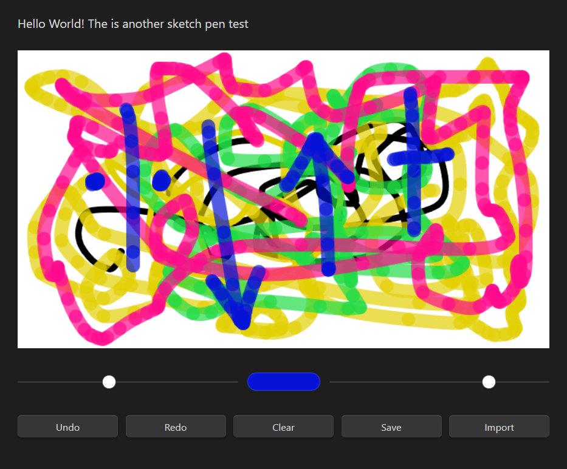
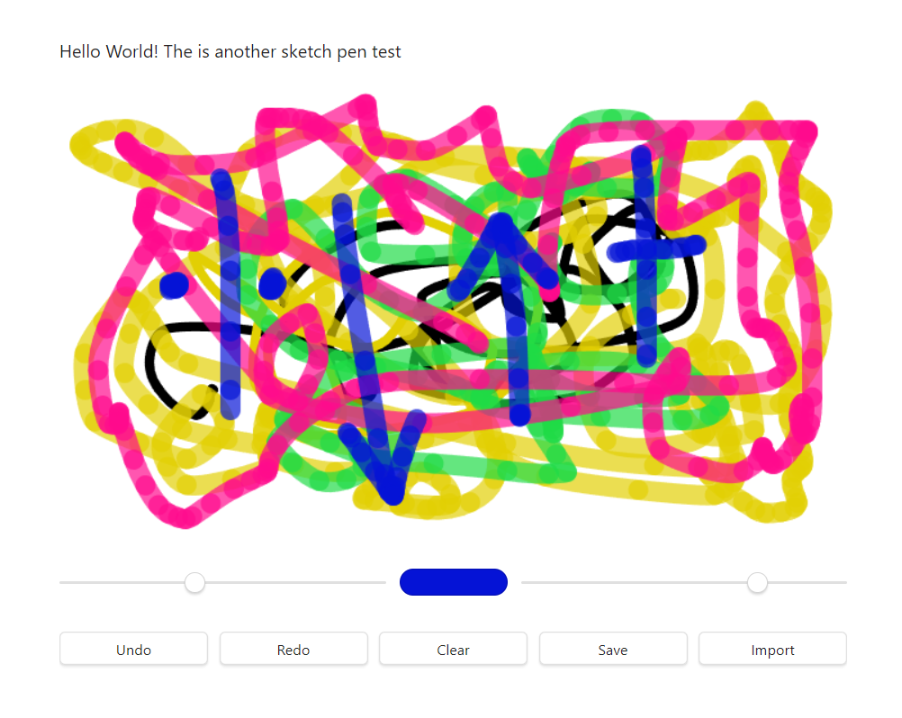
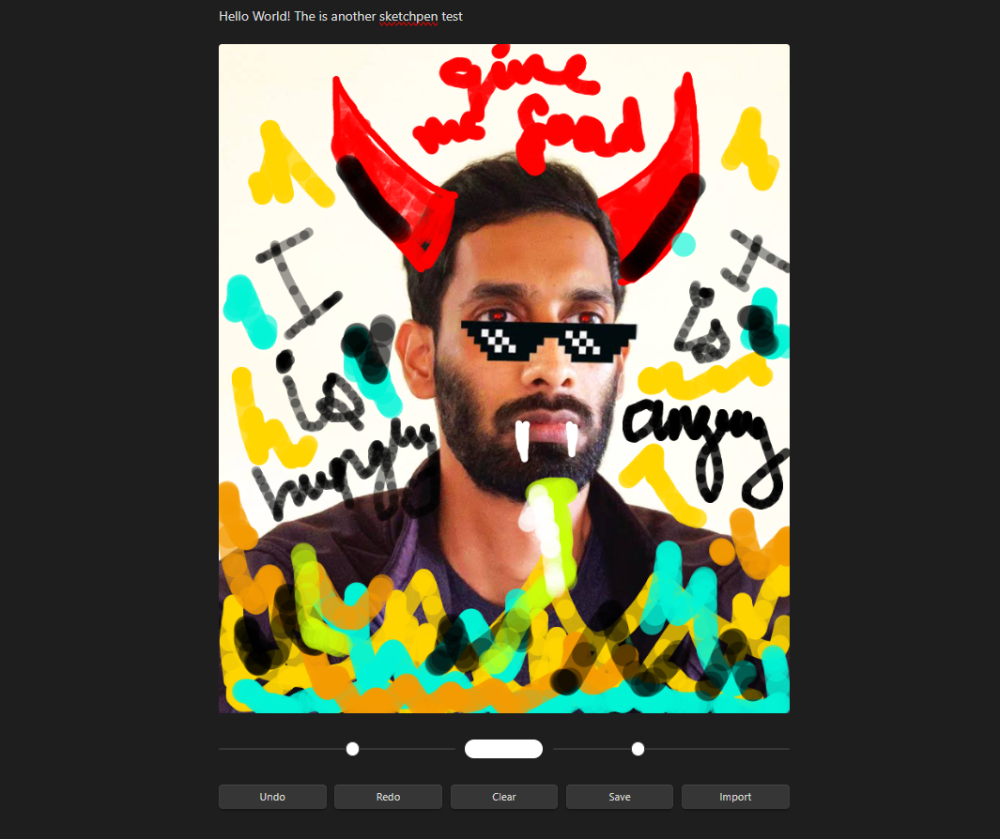
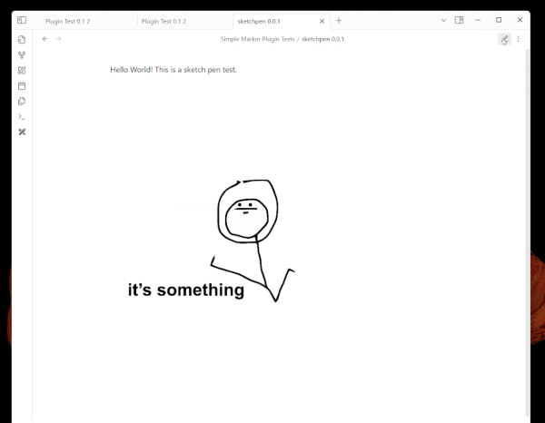
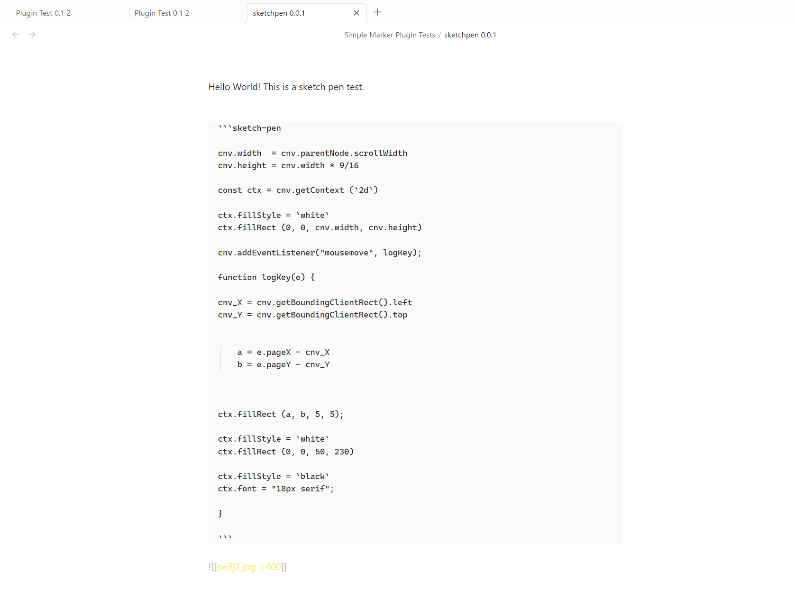

# Markmade

A tool to draw in Obsidian markdown notes.

---
### Update 16.03.2025

- User Interface completely functional
- Embed, Import, Orient Dock, Clear, Delete functions Working
- Added drawing persistence between Source & Preview Mode
- Added drawing persistence between sessions
- Added background auto-save drawing functions
- Added ribbon button to create new drawing

---
### Update 08.03.2025

- Updated the User Interface
- Replaced sliders with buttons
- Changed text to icons in buttons
- Added sub menus
- Changed plugin name to 'Markmade'

---
### Update 13.02.2025

- Added mouse+touch events
- Added Brush Size, Opacity and Colour
- Added Undo and Redo Functionality
- Added Option to Clear Canvas
- Added Option to Save canvas
- Added Option to import image to canvas to annotate
- Removed Hover box-shadow in Live preview mode
- Removed code-edit button in Live preview mode

---

---

## Credits:

Many thanks to [obsidian-canvas-api](https://github.com/capogreco/obsidian-canvas-api) for showing how to run p5js sketches inside Obsidian notes.
Thank you very much to [Daniel Shiffman](https://github.com/shiffman), [The Coding Train Community](https://thecodingtrain.com/) and [Processing Community](https://processing.org/).

## Further reading:

https://developer.mozilla.org/en-US/docs/Web/API/Touch

https://developer.mozilla.org/en-US/docs/Web/API/Touch_events

https://developer.mozilla.org/en-US/docs/Web/API/TouchList

https://developer.mozilla.org/en-US/docs/Web/API/Ink_API

https://developer.mozilla.org/en-US/docs/Web/API/Pointer_events/Multi-touch_interaction

https://developer.mozilla.org/en-US/docs/Web/API/Pointer_events

https://developer-docs.wacom.com/docs/icbt/web/web-api-overview/

